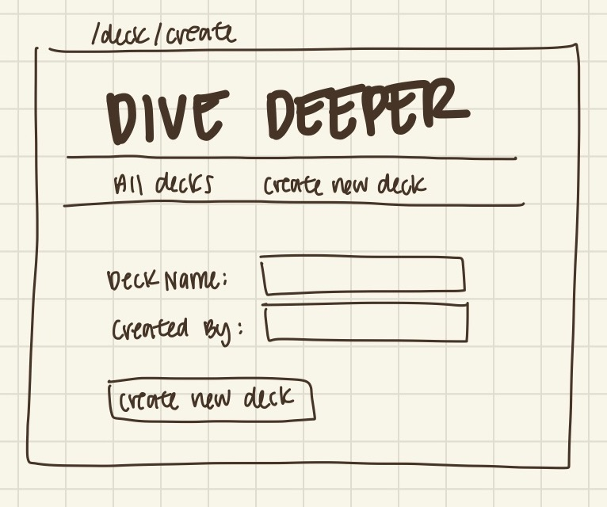
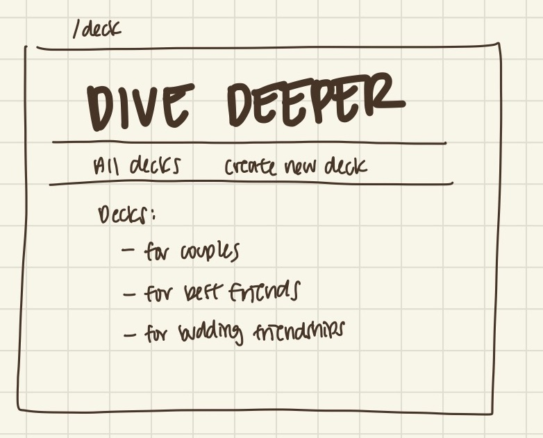
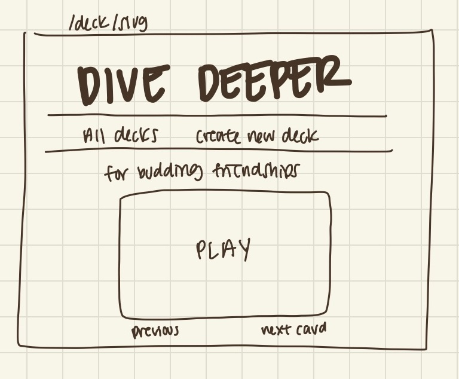
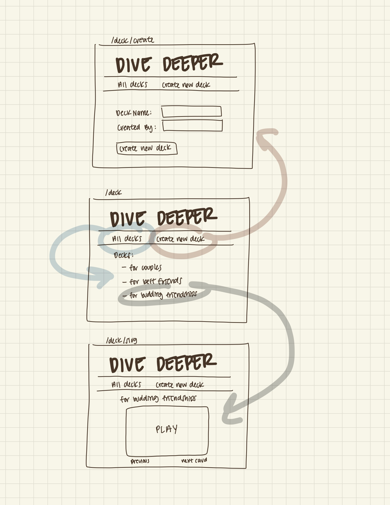

# Dive Deeper 

## Overview

Dive Deeper is a web app that facilitates deeper connections amongst people. It is a card game, with each card having a different question to help the players engage in conversation. Users can register and login, and onced an account is created they can add their own questions, and create their own decks.

## Data Model

The application will store Users, CardDecks, and Questions
* users can have multiple card decks (via references?)
* each card deck contains multiple questions

An Example User:

```javascript
{
  username: "bagelthebeagle",
  hash: // a password hash,
  lists: // an array of references to List documents
}
```

An Example List with Embedded Items:

```javascript
{
  user: // a reference to a User object
  cardDeckName: "For Best Friends",
  items: [
    { question: "What's a compliment you've recieved recently? ", played: false},
    { question: "What was your highlight of the week?", played: true},
  ]
}
```


## [Link to Commented First Draft Schema](db.mjs) 

## Wireframes

/deck/create - page for creating a new deck



/deck - page for showing all decks



/deck/slug - page for showing specific deck



## Site map



## User Stories or Use Cases

1. as non-registered user, I can register a new account with the site
2. as a user, I can log in to the site
3. as a user, I can create a new deck
4. as a user, I can view all of the decks I've created in a single list, as well as default decks
5. as a user, I can add questions to an existing deck
6. as a user, I can remove questions in an existing deck
7. as a user, I can go through the deck, forward and backwards, seeing each individual question at a time

## Research Topics

* (6 points) React frontend framework
TBD, but idea:
* (4 points) combination of:
  * server side javascript library or module not covered in class
  * client side javascript library or module not covered in class

10 points total out of 10 required points


## [Link to Initial Main Project File](app.mjs) 

## Annotations / References Used

n/a for now
